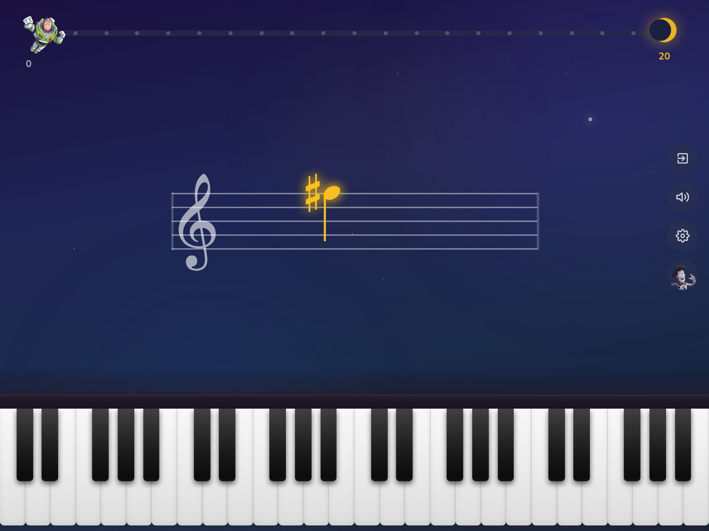
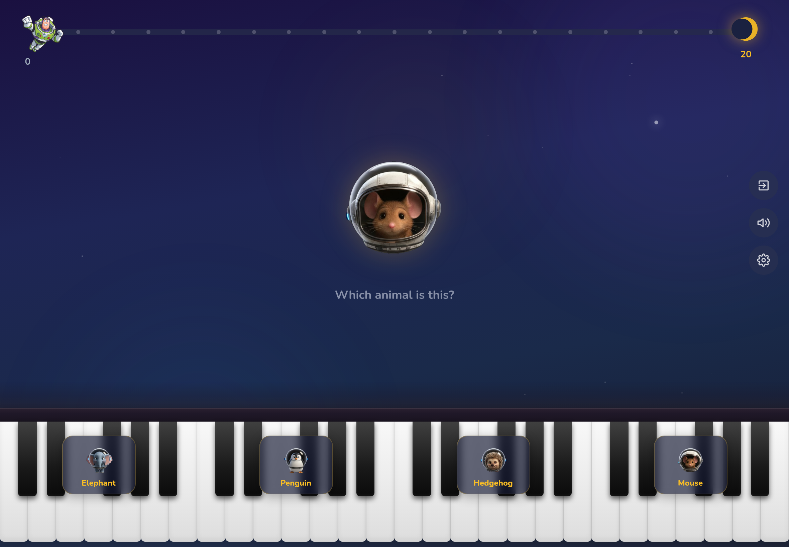
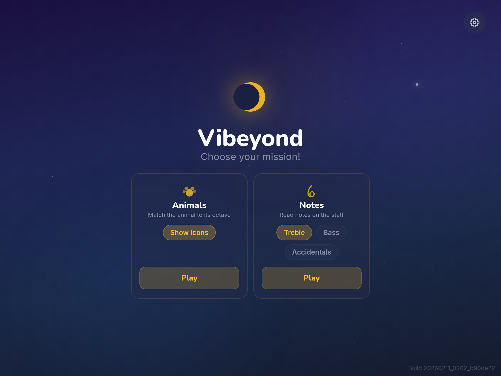
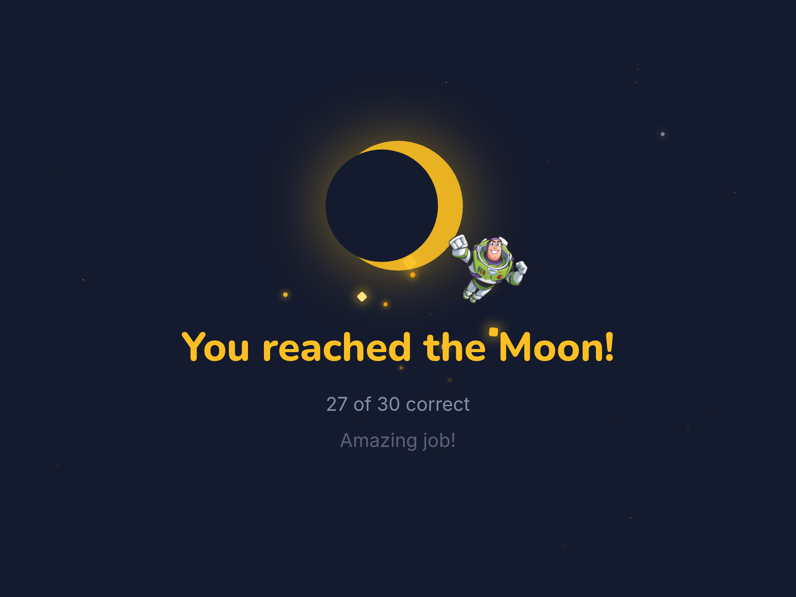

# Vibeyond

**Fly to the Moon, one note at a time!**

A gamified piano note recognition app that turns music practice into a space adventure. Built for a 5-year-old, powered by spaced repetition, and developed with [Claude Code](https://code.claude.com/docs/en/overview).

<p>
  
  
</p>
<p>
  
  
</p>

## The Origin Story

My 5-year-old son, Luca, and I had a deal: 20 minutes of Toy Story, followed by 10 minutes of piano sight-reading. When the timer went off, the transition from the high-stakes adventures of Buzz Lightyear to the static black-and-white lines of a music staff felt impossible. Sight-reading felt like a chore; space travel felt like a mission.

I'd been looking for the perfect use case to stress-test Claude Code -- a project to take vibe coding to infinity and beyond. So I decided to see if I could bridge this gap before the new week starts.

## How It Works

A note appears on the staff. Tap the matching key on the piano. Get it right and Buzz flies closer to the Moon. Get it wrong and he drifts back. Reach the Moon to complete the session.

Under the hood, [FSRS](https://github.com/open-spaced-repetition/ts-fsrs) (Free Spaced Repetition Scheduler) tracks which notes the player knows well and which need more practice. Difficult notes come back more often; mastered notes fade into the background.

## Missions

### Animal Octaves
During initial user testing, Luca's 3-year-old brother Elio got jealous and demanded his own turn. The note-reading mission was too advanced for him, so I created a simplified mode: an animal appears on screen (Elephant, Penguin, Hedgehog, or Mouse -- each mapped to an octave) and you tap the matching octave button overlaid on the piano. Each animal plays a characteristic chord when selected. Animal icons on the buttons can be toggled on/off for difficulty.

### Note Reading
A note appears on the treble or bass clef staff. Identify it by tapping the correct key on the piano. Configurable options directly on the home screen:
- **Treble** / **Bass** clef (or both)
- **Accidentals** toggle (sharps and flats, including enharmonics like E#, Cb, B#, Fb)

## Features

- **Space theme** -- Cozy, warm aesthetic inspired by Pixar's *La Luna*. Deep twilight blues with animated star parallax.
- **Two mission types** -- Animal octave recognition and note reading on the staff.
- **Spaced repetition** -- FSRS schedules challenges based on memory strength, not random order.
- **Salamander Grand Piano** -- Real piano samples via Tone.js, with a lightweight synth fallback while samples load.
- **Hint system** -- Woody pops up with mnemonic hints for note reading (e.g. "Every Good Boy Does Fine").
- **Realistic piano keyboard** -- No labels on keys. Parent-configurable range (full octaves, C2-B5 default).
- **Progress tracking** -- Buzz flies along a progress bar toward the Moon. Mistakes cost a step back.
- **Celebration screen** -- Firework animation with score summary when a session is completed.
- **Enharmonic-aware evaluation** -- C# and Db are recognized as the same pitch.
- **Card inspector** -- Parent-facing screen showing all FSRS cards, states, and success rates.
- **MIDI keyboard support** -- Connect a real piano via USB and the MIDI bridge server. Auto-detects, no configuration.
- **Installable PWA** -- Service worker with auto-update. Install to home screen on iPad or any device.
- **Offline-first** -- All data in IndexedDB via Dexie.js. No server, no account, no data leaves the device.
- **iPad-optimized** -- Primary target is iPad in landscape, with iOS safe area support.
- **Build stamp** -- Build ID shown on the home screen for version tracking.
- **DB error recovery** -- If IndexedDB gets corrupted (e.g. after an update), a recovery dialog lets you reset and reload.

## Tech Stack

| Layer | Technology |
|-------|-----------|
| Framework | React 18 + TypeScript |
| Build | Vite 5 |
| Styling | Tailwind CSS 4 |
| Animation | Framer Motion |
| Music notation | VexFlow 5 |
| Audio | Tone.js (Salamander Grand Piano samples) |
| Spaced repetition | ts-fsrs |
| State management | Zustand |
| Local database | Dexie.js (IndexedDB) |
| PWA | vite-plugin-pwa (Workbox) |

## Try It

There are two ways to use the app:

### 1. Vercel (touch only)
The app is live at **https://vibeyond.vercel.app/**. Install it as a PWA from Safari or Chrome using "Add to Home Screen" — it works offline once installed and auto-updates.

### 2. MIDI Bridge (physical keyboard)
Connect a physical digital piano via USB to a Mac/PC on the same WiFi as your iPad. A small Node.js bridge server reads USB MIDI, serves the built PWA, and forwards note events over WebSocket — all on one port.

**Prerequisites:** Node.js 18+, a USB MIDI keyboard connected to the computer.

```bash
# 1. Build the PWA (outputs to dist/)
npm run build

# 2. Install bridge dependencies (first time only)
cd midi-bridge && npm install

# 3. Start the bridge
npm start
```

Output:
```
Vibeyond MIDI Bridge
  MIDI input: "Yamaha Digital Piano"
  Serving:    http://my-mac.local:3001

Open the URL above on your iPad.
```

Open that URL on your iPad. The app auto-detects the MIDI bridge and shows a green "MIDI" indicator. Physical key presses play audio, light up on-screen keys, and submit answers — no configuration needed.

**Platform notes:**
- **macOS** -- `.local` hostname works out of the box via Bonjour
- **Windows** -- You may need to use the computer's IP address instead of `.local`
- **iOS** -- Will prompt once to allow local network access; tap "Allow"

Both modes use the same PWA code. MIDI auto-detects based on how the app is served.

## Building from Source

```bash
npm install
npm run dev
```

The dev server starts on `http://localhost:5173`. To access from another device on your network (e.g. an iPad):

```bash
npm run dev -- --host
```

Then open `http://<your-ip>:5173` on the device.

### Build for Production

```bash
npm run build
npm run preview
```

### Run Tests

```bash
npm test
```

### Parent Settings

Tap the gear icon on the home screen to configure:

- **Session length** -- How many correct answers to reach the Moon (5-30, default 30).
- **Note range** -- Which octaves appear on the piano keyboard.
- **Card inspector** -- View all FSRS cards and their learning state.
- **Reset data** -- Clear all progress and start fresh.

## Project Structure

```
src/
  components/    UI components (StaffDisplay, PianoKeyboard, AnimalPrompt, OctaveButtons, ...)
  screens/       Route screens (Home, Session, Settings, CardInspector)
  logic/         Pure business logic (evaluate, scheduler, progression, noteUtils, hints)
  store/         Zustand stores (settings, cards, session)
  db/            Dexie.js schema and database
  missions.ts    Mission definitions and config-to-ID mapping
  types.ts       Shared TypeScript types
public/
  *.png          Animal images (Pixar-style), character sprites, PWA icons
  audio/         Chord audio samples for the animal mission
```

## License

MIT
