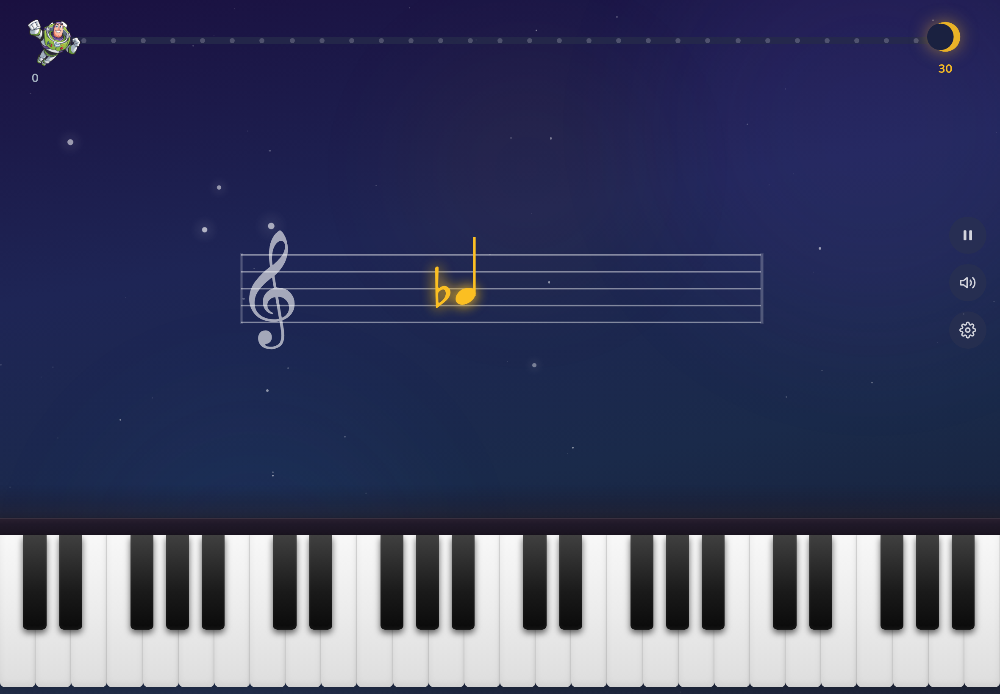
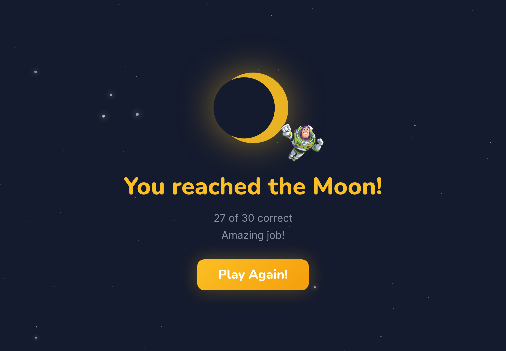
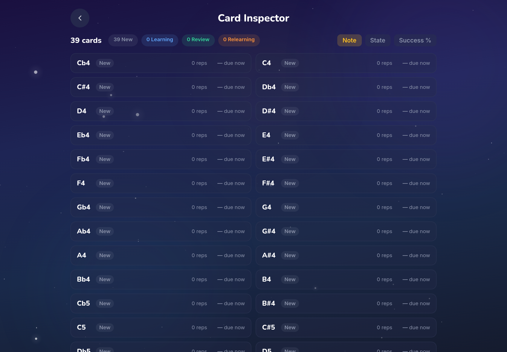
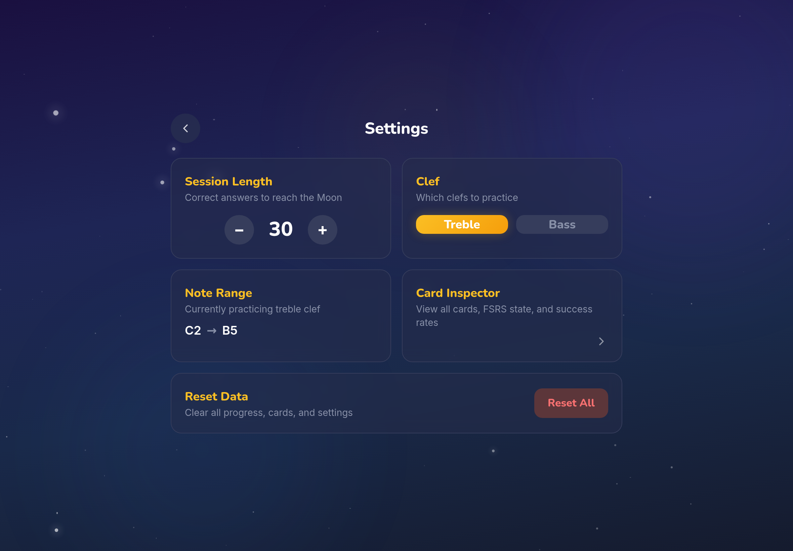

# Vibeyond

**Fly to the Moon, one note at a time!**

A gamified piano sight-reading app that turns music practice into a space adventure. Built for a 5-year-old, powered by spaced repetition, and developed in a single evening with [Claude Code](https://claude.ai/claude-code).

<p>
  
  
</p>
<p>
  
  
</p>

## The Origin Story

Most great software is born out of necessity. Vibeyond was born out of a Sunday afternoon negotiation that I realized I was losing.

My 5-year-old son, Luca, and I had a deal: 20 minutes of Toy Story, followed by 10 minutes of piano sight-reading. When the timer went off, the transition from the high-stakes adventures of Buzz Lightyear to the static black-and-white lines of a music staff felt impossible. Sight-reading felt like a chore; space travel felt like a mission.

I'd been looking for the perfect use case to stress-test Claude Code — a project to take vibe coding to infinity and beyond. So I decided to see if I could bridge this gap before the new week starts.

### The Build Sprint

The speed of the development process was, frankly, astounding. By acting as the "product owner" and "architect" while letting the agent handle the heavy lifting, I went from a frustrated "no" to a ready-to-test app in a single evening:

| Phase | Time | Effort |
|-------|------|--------|
| PDD (Product Design) | 30m | Braindumping thoughts and constraints to the agent. |
| TDD (Technical Design) | 30m | Answering clarifying questions on architecture (FSRS, IndexedDB). |
| MVP Build | 1h | Core logic, staff rendering, and piano keyboard (including debugging). |
| UX Polish | 2h | Animating Buzz, the space theme, and the Woody hint system. |
| **Total** | **4 Hours** | **Ready for Luca to test tomorrow.** |

## How It Works

A note appears on the staff. Tap the matching key on the piano. Get it right and Buzz flies closer to the Moon. Get it wrong and he drifts back. Reach the Moon to complete the session.

Under the hood, [FSRS](https://github.com/open-spaced-repetition/ts-fsrs) (Free Spaced Repetition Scheduler) tracks which notes Luca knows well and which need more practice. Notes he struggles with come back more often. Notes he's mastered fade into the background. The app adapts to him, not the other way around.

## Features

- **Space theme** -- Cozy, warm aesthetic inspired by Pixar's *La Luna*. Deep twilight blues, not harsh neon.
- **Spaced repetition** -- FSRS schedules note challenges based on memory strength, not random order.
- **Full accidental support** -- All sharps and flats, including theoretical enharmonics (E#, Cb, B#, Fb).
- **Enharmonic-aware evaluation** -- C# and Db are recognized as the same pitch.
- **Realistic piano** -- No labels on keys. Configurable range (full octaves, C2-B5 default).
- **Progress tracking** -- Buzz flies along a progress bar with star-dot milestones. Mistakes cost a full step back.
- **Audio feedback** -- Tone.js plays the note you tap, with a global mute toggle.
- **Card inspector** -- Parent-facing screen showing all FSRS cards, states, and success rates.
- **Offline-first** -- IndexedDB via Dexie.js. No server, no account, no data leaves the device.
- **iPad-optimized** -- Primary target is iPad in landscape, with safe area insets.

## Tech Stack

| Layer | Technology |
|-------|-----------|
| Framework | React 18 + TypeScript |
| Build | Vite 5 |
| Styling | Tailwind CSS 4 |
| Animation | Framer Motion |
| Music notation | VexFlow 5 |
| Audio | Tone.js |
| Spaced repetition | ts-fsrs |
| State management | Zustand |
| Local database | Dexie.js (IndexedDB) |

## Getting Started

On any computer on your home network:

```bash
npm install
npm run dev -- --host
```

Then open `http://your-server:5173` on your iPad (replace `your-server` with the computer's hostname or local IP address). The `--host` flag makes Vite listen on all network interfaces so the iPad can reach it.

### Parent Settings

Tap the gear icon on the home screen to configure:

- **Session length** -- How many correct answers to reach the Moon (default: 30).
- **Note range** -- Which octaves appear on the piano keyboard.
- **Clef** -- Treble, bass, or both.
- **Card inspector** -- View all cards and their FSRS learning state.
- **Reset data** -- Clear all progress and start fresh.

## Project Structure

```
src/
  components/    UI components (StaffDisplay, PianoKeyboard, ProgressionBar, ...)
  screens/       Route screens (Home, Session, Settings, CardInspector)
  logic/         Pure business logic (evaluate, scheduler, progression, noteUtils)
  store/         Zustand stores (settings, cards, session)
  db/            Dexie.js schema and database
  types.ts       Shared TypeScript types
docs/
  PRD.md         Product requirements
  TDD.md         Technical design
  UX-SPEC.md     Visual design spec and review notes
```

## License

MIT
