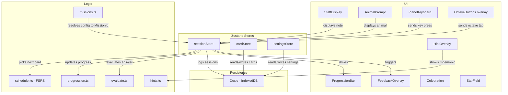
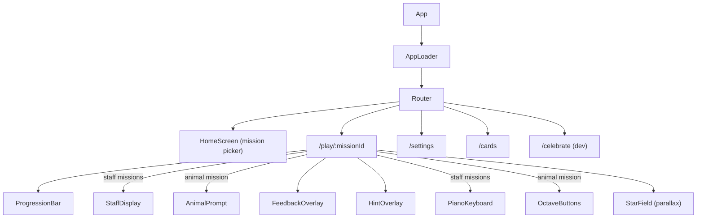

# Technical Design Document (TDD)

## Glossary

| Term | Definition |
|---|---|
| **Mission** | The top-level play choice: Animals or Notes. Each mission defines the prompt type (animal picture vs. staff note) and input type (octave buttons vs. piano keys). |
| **Notes config** | The three toggles on the Notes mission card: Treble (on/off), Bass (on/off), Accidentals (on/off). Each unique combination produces its own FSRS card pool. Persisted to DB. |
| **MissionId** | A string key derived from the mode + config. `"animal-octaves"` for Animals, or `"notes:treble"`, `"notes:bass"`, `"notes:treble+bass"`, `"notes:treble:acc"`, `"notes:bass:acc"`, `"notes:treble+bass:acc"` for Notes. Used as the card pool key and session tag. |
| **Challenge** | A single question within a session. The prompt is a staff note (Notes mission) or animal picture (Animals mission); the response is a piano key press or octave button tap. |
| **Session** | One complete play-through — Buzz starts at the left, the learner works through challenges, and the session ends when Buzz reaches the Moon (or the learner quits). Each session belongs to a specific MissionId. |
| **Card** | An FSRS spaced-repetition card wrapping a single learnable item. In the Notes mission, this is a note. In the Animals mission, this is an octave. Each MissionId has its own independent card pool. |
| **Progression** | The visual Buzz Lightyear → Moon mechanic. Correct answers advance Buzz, incorrect answers move him backward. Uses floor-at-zero scoring (no negative debt). Reaching the Moon completes the session. |
| **Note** | A musical note identified by pitch (C–B), accidental (sharp/flat/natural), octave, and clef. |

---

## Architecture Overview

Vibeyond is a configurable music recognition app with two missions. The core loop — show a prompt, accept input, evaluate, track mastery — is shared. What varies is the mission (Animals vs. Notes), and within Notes, the clef/accidentals configuration that determines the card pool.



**UI layer** — React components for prompts (staff display, animal prompt), inputs (piano keyboard, octave buttons overlay), progression bar, feedback animations, hint overlays, celebration screen, and parallax starfield. These receive data and fire callbacks; they don't manage session state.

**Store layer** — Three Zustand stores orchestrate state:
- `sessionStore` — Session lifecycle, phase machine (idle/playing/feedback/complete), hint state, scoring. Calls into logic functions and other stores.
- `cardStore` — Mission-scoped FSRS card pools. `ensureCardsForMission` seeds new cards and prunes stale ones.
- `settingsStore` — Settings persistence with forward-compatible merging of compile-time defaults.

**Logic layer** — Pure functions with no side effects: FSRS scheduling (`scheduler.ts`), answer evaluation (`evaluate.ts`), progression calculation (`progression.ts`), mnemonic hints (`hints.ts`), note utilities (`noteUtils.ts`), and mission resolution (`missions.ts`).

**Persistence layer** — Dexie wrapping IndexedDB. Stores FSRS cards (keyed by MissionId + note ID), session history, and settings (as JSON key-value). No backend. The only external network request is loading piano samples from the Tone.js CDN (cached by service worker).

### React Component Tree



`AppLoader` hydrates Zustand stores from IndexedDB on startup. If IndexedDB fails, a `DbErrorDialog` offers a one-click reset. Three decorative nebula `<div>` layers are rendered behind the router for the cosmic background glow.

---

## Tech Stack

| Concern | Choice | Version | Rationale |
|---|---|---|---|
| Framework | React + TypeScript | React 18.3, TS 5.6 | Component model fits UI layer; strong typing for data model |
| Build tool | Vite | 5.4 | Fast dev server, native TS/TSX support, easy PWA plugin |
| Styling | Tailwind CSS | 4.1 | Utility-first via `@theme` directive in CSS, rapid iteration, small bundle with purging |
| Animations | Framer Motion | 12.33 | Declarative spring animations for bouncy, toy-like feel |
| Music notation | VexFlow | 5.0 | Staff rendering with correct note placement on treble and bass clefs |
| Audio | Tone.js (Salamander Grand Piano samples) | 15.1 | Sampler loads real piano samples from Tone.js CDN with PolySynth fallback during async load |
| Spaced repetition | ts-fsrs | 5.2 | TypeScript FSRS implementation; child-tuned parameters (0.95 retention, 30-day max) |
| State management | Zustand | 5.0 | Minimal boilerplate, works well with React; simpler than Redux, more capable than Context for cross-cutting state |
| Persistence | Dexie.js (IndexedDB) | 4.3 | Typed IndexedDB wrapper; simple migrations |
| Routing | React Router DOM | 7.13 | Client-side routing with URL params for mission IDs |
| PWA | vite-plugin-pwa | 1.2 | Service worker generation via Workbox, autoUpdate registration, asset pre-caching for offline support |
| Testing | Vitest + React Testing Library | Vitest 4.0 | Fast, Vite-native test runner (no tests written yet) |
| Linting | ESLint + Prettier | ESLint 9, Prettier 3.8 | Standard code quality tooling |

---

## Data Model

### Core Entities

All types are defined in `src/types.ts`.

```typescript
type MissionId = string;
// "animal-octaves" for Animals, or "notes:<clefs>[:<acc>]" for Notes.
// e.g. "notes:treble", "notes:bass", "notes:treble+bass:acc"

interface AnimalsConfig {
  showIcons: boolean;        // toggle animal icons on octave buttons
}

interface NotesConfig {
  treble: boolean;           // include treble clef notes
  bass: boolean;             // include bass clef notes
  accidentals: boolean;      // include sharps/flats
}

interface Note {
  pitch: "C" | "D" | "E" | "F" | "G" | "A" | "B";
  accidental: "sharp" | "flat" | "natural";
  octave: number;            // e.g. 4 for middle C
  clef: "treble" | "bass";
}

type NoteId = string;        // "treble:C:natural:4"

interface AppCard extends FSRSCard {
  id: string;                // compound PK: "${missionId}::${noteId}"
  noteId: NoteId;
  missionId: MissionId;
}

interface Challenge {
  promptNote: Note;
  responseNote: Note | null;
  correct: boolean | null;
  responseTimeMs: number | null;
  timestamp: Date;
}

interface Session {
  id: string;
  missionId: MissionId;
  startedAt: Date;
  completedAt: Date | null;
  challenges: Challenge[];
  totalCorrect: number;
  totalIncorrect: number;
  score: number;              // floor-at-zero semantics
  completed: boolean;
}

interface Settings {
  noteRange: {
    minNote: Note;            // keyboard display range (default C2-B5)
    maxNote: Note;
  };
  sessionLength: number;      // correct answers needed to reach Moon (default 20)
  animalsConfig: AnimalsConfig;
  notesConfig: NotesConfig;
}

/** Static definition of a mission (code-only, not persisted). */
interface MissionDefinition {
  id: MissionId;
  name: string;
  description: string;
  promptType: "staff" | "animal";
  inputType: "piano" | "octave-buttons";
  enabledClefs: ("treble" | "bass")[];
  includeAccidentals: boolean;
  challengeRange: { minNote: Note; maxNote: Note };
  perClefRanges?: Record<string, { minNote: Note; maxNote: Note }>;
  defaultSessionLength: number;
}
```

### MissionId Resolution

The `MissionId` is not a fixed enum — it's derived at runtime from the user's mode selection and toggle state:

```typescript
/** Derive MissionId from the Notes mission toggles. */
function notesConfigToMissionId(config: NotesConfig): MissionId {
  const clefs: string[] = [];
  if (config.treble) clefs.push("treble");
  if (config.bass) clefs.push("bass");
  const base = `notes:${clefs.join("+")}`;
  return config.accidentals ? `${base}:acc` : base;
}

// Examples:
// { treble: true, bass: false, accidentals: false } → "notes:treble"
// { treble: true, bass: true, accidentals: true }   → "notes:treble+bass:acc"
// { treble: false, bass: true, accidentals: false }  → "notes:bass"
```

Each unique MissionId gets its own independent FSRS card pool. Switching toggles doesn't destroy progress — previous configurations retain their cards in the DB.

### Card Pool Generation

When a session starts, cards are seeded for the resolved MissionId:

- **Animals mission (`"animal-octaves"`):** 4 cards, one per octave (C2, C3, C4, C5).
- **Notes mission:** Cards are generated from the challenge range for each enabled clef, filtered to naturals-only if accidentals are off.
  - Treble range: C4–A5
  - Bass range: E2–C4

### Dexie Schema

```typescript
const db = new Dexie("VibeyondDB");

// Version 1: original schema (cards keyed by noteId, no missionId)
db.version(1).stores({
  cards: "noteId, due, state",
  sessions: "id, startedAt",
  settings: "key",
});

// Version 2: mission-scoped cards with compound PK
db.version(2).stores({
  cards: "id, noteId, missionId, due, state",  // id = "${missionId}::${noteId}"
  sessions: "id, missionId, startedAt",
  settings: "key",
}).upgrade((tx) => tx.table("cards").clear());  // wipe v1 cards (wrong PK)
```

Settings are stored as a single JSON-serialized row keyed by `"appSettings"`. New settings fields are forward-compatible: on load, stored values are shallow-merged with compile-time defaults so newly added fields get sensible values without a DB migration.

---

## Key Functions

The core logic is a set of plain functions — no abstract interfaces or plugin system. All are pure (no side effects, no store dependencies).

### `logic/evaluate.ts`

```typescript
/** Enharmonic-aware note comparison (C# = Db, E# = F, etc.). */
function evaluateAnswer(prompt: Note, response: Note): EvalResult;

/** Octave-only comparison for Animals mission. */
function evaluateOctaveAnswer(prompt: Note, responseOctave: number): EvalResult;
```

### `logic/scheduler.ts`

```typescript
/** Create a compound card ID: "${missionId}::${noteId}". */
function cardId(missionId: MissionId, noteId: NoteId): string;

/** Mint a new FSRS card for a note. Starts in state New, due immediately. */
function createCard(noteId: NoteId, missionId: MissionId): AppCard;

/** Review a card: maps correct→Rating.Good, incorrect→Rating.Again. */
function reviewCard(card: AppCard, correct: boolean): AppCard;

/**
 * Select next card from pool. Priority: due cards (random tie-break) →
 * new cards (if under maxNewPerSession cap) → soonest-due fallback.
 */
function selectNextCard(
  cards: AppCard[],
  newCardsSeenThisSession: number,
  maxNewPerSession?: number,  // default 2
): AppCard | null;
```

### `logic/progression.ts`

```typescript
/** Calculate Buzz's position (0–1) from the session's running score. */
function calculateProgression(score: number, sessionLength: number): number;

/** Check if score has reached sessionLength. */
function isSessionComplete(score: number, sessionLength: number): boolean;
```

### `logic/hints.ts`

```typescript
interface Hint {
  label: string;           // "Lines" or "Spaces"
  mnemonic: string;        // e.g. "Every Good Bird Deserves Fun (Always)"
  accidentalNote: string | null;  // "with a sharp" / "with a flat" / null
}

/** Get the contextual mnemonic hint for a note's staff position. */
function getHint(note: Note): Hint;
```

### `logic/noteUtils.ts`

```typescript
function noteToId(note: Note): NoteId;         // "treble:C:natural:4"
function noteFromId(id: NoteId): Note;          // parse back
function noteToSemitone(note: Note): number;    // absolute pitch for comparison
function notesMatch(a: Note, b: Note): boolean; // enharmonic semitone equality
function noteRange(min: Note, max: Note, clef: string): Note[]; // all notes in range
function noteToString(note: Note): string;      // human-readable "C4", "F#5"
```

### `missions.ts`

```typescript
/** Derive a stable MissionId from NotesConfig toggles. */
function notesConfigToMissionId(config: NotesConfig): MissionId;

/** Resolve a MissionId to its full MissionDefinition (static for animals, dynamic for notes). */
function resolveMission(id: MissionId): MissionDefinition;
```

### FSRS Configuration

Default FSRS parameters are calibrated for adult Anki users. A 5-year-old needs higher success rates (motivation), shorter initial intervals (weaker working memory for abstract symbols), and a capped maximum interval (notes should never fully disappear).

```typescript
import { fsrs, generatorParameters } from 'ts-fsrs';

const params = generatorParameters({
  request_retention: 0.95,    // Default 0.9 — higher keeps success rate up for morale
  maximum_interval: 30,       // Default 36500 — cap at 30 days so mastered notes still recur
  enable_fuzz: true,          // Random jitter so reviews don't cluster on the same day
  enable_short_term: true,    // Sub-day intervals for new/learning cards
});

const scheduler = fsrs(params);
```

**Rationale:**
- **0.95 retention** — A 5% failure rate instead of 10%. Keeps Buzz moving forward more often, building a positive feedback loop.
- **30-day max interval** — Even mastered notes pop up monthly as easy wins.
- **Binary rating** — Only `Rating.Good` (correct) and `Rating.Again` (incorrect) are used. A 5-year-old's answer is binary: either they pressed the right key or they didn't.
- **Fuzzing** — Small random jitter prevents all reviews clustering on the same day.

**Session guardrail:** New-card introduction is rate-limited to 2 per session (`maxNewPerSession`). When selecting the next card, due cards are prioritized with random tie-breaking among equally-due cards (within 1 minute). If no cards are due and the new-card cap is reached, the soonest-due card is picked as a fallback.

---

## Project Structure

```
vibeyond/
├── docs/
│   ├── PRD.md
│   ├── TDD.md
│   ├── UX-SPEC.md
│   └── RETENTION.md
├── mocks/                       # Visual design mockups (PSD, PNG)
├── screenshots/                 # Automated screenshots (Puppeteer)
│   └── capture.cjs
├── public/
│   ├── buzz.png                 # Buzz Lightyear character image
│   ├── woody.png                # Woody character image (hint button)
│   ├── elephant.png             # Pixar-style animal illustrations (PNG)
│   ├── penguin.png
│   ├── hedgehog.png
│   ├── mouse.png
│   ├── icon-192.png             # PWA icon (192x192)
│   ├── icon-512.png             # PWA icon (512x512)
│   └── favicon.ico
├── src/
│   ├── main.tsx                 # Entry point (StrictMode + root mount)
│   ├── App.tsx                  # Router + AppLoader + DbErrorDialog + nebula layers
│   ├── index.css                # Tailwind @theme directive, nebula/star CSS animations, safe area insets
│   ├── types.ts                 # Shared type definitions (all core domain types)
│   ├── missions.ts              # Mission registry + notesConfigToMissionId + resolveMission
│   ├── logic/                   # Pure business logic (no UI)
│   │   ├── progression.ts       # calculateProgression + isSessionComplete
│   │   ├── scheduler.ts         # FSRS wrapper (createCard, reviewCard, selectNextCard)
│   │   ├── evaluate.ts          # evaluateAnswer + evaluateOctaveAnswer (enharmonic-aware)
│   │   ├── noteUtils.ts         # noteToId, noteFromId, noteRange, noteToSemitone, etc.
│   │   └── hints.ts             # getHint — mnemonic hint generator for treble/bass lines/spaces
│   ├── components/              # React components
│   │   ├── StaffDisplay.tsx     # VexFlow 5 SVG staff rendering (gold notehead, glow filter)
│   │   ├── PianoKeyboard.tsx    # Interactive piano (Salamander samples, no labels, gold flash)
│   │   ├── OctaveButtons.tsx    # Animal buttons overlaid on piano (glass-effect badges)
│   │   ├── AnimalPrompt.tsx     # Animal image display + chord voicings per octave
│   │   ├── useAudio.ts          # Tone.js Sampler + PolySynth fallback hook
│   │   ├── ProgressionBar.tsx   # Buzz → Moon horizontal progress bar with milestones
│   │   ├── FeedbackOverlay.tsx  # Gold star burst (correct) / red X shake (incorrect)
│   │   ├── HintOverlay.tsx      # Mnemonic hint overlay (auto-dismiss 4s)
│   │   ├── Celebration.tsx      # Moon-reached celebration (confetti, score, Play Again)
│   │   └── StarField.tsx        # 3-layer parallax starfield (seeded PRNG, 195 stars)
│   ├── screens/                 # Top-level route screens
│   │   ├── HomeScreen.tsx       # Mission picker (Animals + Notes cards, toggle chips)
│   │   ├── SessionScreen.tsx    # Core gameplay (adapts per mission, side controls)
│   │   ├── CardInspectorScreen.tsx  # FSRS card browser (filter, sort, stats)
│   │   └── ParentSettingsScreen.tsx # Settings (session length, note range, reset data)
│   ├── store/                   # Zustand stores
│   │   ├── sessionStore.ts      # Session lifecycle, hint state, scoring, phase machine
│   │   ├── cardStore.ts         # Mission-scoped FSRS card pools + ensureCardsForMission
│   │   └── settingsStore.ts     # Settings persistence with forward-compatible merging
│   └── db/                      # Dexie database setup
│       └── db.ts                # Schema v1→v2 migration, typed EntityTables
├── index.html                   # Meta tags (viewport-fit, apple-mobile-web-app, fonts)
├── vite.config.ts               # Build config (React, Tailwind, PWA, build stamp)
├── vitest.config.ts             # Separate Vitest config (avoids Vite type conflicts)
├── tsconfig.json
├── package.json
└── README.md
```

---

## Card Inspector (Implemented)

The Card Inspector is a parent-facing screen at `/cards`, linked from the Settings screen. It gives full visibility into the FSRS card state across all missions.

### Data Sources

All data comes from existing stores:

- **Card list + FSRS state**: `cardStore` → Dexie `cards` table. Each `AppCard` has `id`, `missionId`, `noteId`, `state` (New/Learning/Review/Relearning), `reps`, `lapses`, `due`, `stability`, `difficulty`.
- **Per-card success rate**: Computed by scanning `Session.challenges` from Dexie `sessions` table on mount.

### Features

- **Mission filter tabs**: "All" + one tab per mission that has cards. Dynamically derived from card data.
- **Summary bar**: Total card count + colored state breakdown badges (New=gray, Learning=blue, Review=green, Relearning=orange).
- **Sort controls**: Toggle between note order (by semitone), FSRS state, or success rate ascending.
- **2-column card grid**: Each card row shows note name, state badge, rep count, success rate (color-coded: green >= 80%, gold >= 50%, red < 50%), and due status ("due now" / "in Xh" / "in Xd").
- **Stats computation**: `computeNoteStats()` scans all session challenges on mount — no real-time reactivity needed for this read-only diagnostic view.

---

## Infrastructure

### PWA Configuration

The app is a fully offline-capable PWA via `vite-plugin-pwa`:

- **Service worker**: `registerType: 'autoUpdate'` — the service worker updates automatically in the background. No user prompt needed.
- **Manifest**: `display: standalone`, `orientation: landscape`, theme color `#1a1040`. Icons at 192px and 512px (also maskable).
- **Workbox pre-caching**: `globPatterns: ['**/*.{js,css,html,png,jpg,svg,webp,mp3,ogg,woff,woff2}']` — all static assets are pre-cached for offline use.
- **iOS meta tags**: `apple-mobile-web-app-capable`, `black-translucent` status bar, apple-touch-icon.
- **Build stamp**: `__BUILD_TIME__` is injected at build time as `YYYYMMDD_HHMM_<git-hash>` for version tracking.

### Hosting

Static site hosting — one of:
- **Vercel** (preferred) — zero-config Vite deploys, preview deploys on PRs
- GitHub Pages — simpler, free, good fallback option

No server component. All logic runs client-side. All data stays in the browser's IndexedDB. Piano samples are loaded from the Tone.js CDN at runtime and cached by the service worker.

### CI/CD

GitHub Actions pipeline (planned):

```yaml
# On push/PR to main
- TypeScript type-check (tsc --noEmit)
- ESLint
- Vitest (unit + component tests) — tests not yet written
- Build (vite build)
- Lighthouse CI (PWA score, performance budget)
```

### Deployment

- `main` branch auto-deploys to production
- PR branches get preview deploys (Vercel/Netlify)
- No staging environment needed — single-user app

---

## Security Considerations

**Threat model**: This is a single-user, local-only app with no authentication, no backend, and no sensitive data. The attack surface is minimal.

- **No auth required** — the app is used by one family on their own device. Parent settings are accessible but not security-critical.
- **No sensitive data** — only FSRS card states and session history are stored in IndexedDB. No PII, no credentials.
- **Dependencies** — keep dependencies minimal and audit with `npm audit` in CI.
- **External network calls** — the only runtime network request is loading Salamander Grand Piano samples from `tonejs.github.io`. Once cached by the service worker, the app is fully offline.

---

## Feature Implementation Map

Cross-reference of every feature from the PRD with its technical implementation:

| PRD Feature | Status | Technical Implementation |
|---|---|---|
| Mission system | Done | `missions.ts` (registry + `resolveMission` + `notesConfigToMissionId`) + `HomeScreen` (mission picker with toggle chips) + `SessionScreen` (adapts per mission via URL param) |
| Animal Octaves mission | Done | `AnimalPrompt` (PNG images + chord voicings) + `OctaveButtons` (glass-effect badges overlaid on piano) + `AnimalsConfig.showIcons` toggle. 4-card FSRS pool (octaves 2-5). |
| Notes mission | Done | `StaffDisplay` (VexFlow 5) + `PianoKeyboard` (Salamander samples). Toggle-configurable: Treble/Bass/Accidentals. Per-clef ranges via `perClefRanges` in treble+bass mode. Each toggle combo gets its own FSRS card pool. |
| Staff display | Done | `StaffDisplay` using VexFlow 5 SVG backend. 2x scale, gold notehead with SVG glow filter, translucent white staff lines. Supports treble and bass clef. |
| On-screen piano | Done | `PianoKeyboard` — realistic black+white keys, no labels. `useAudio` hook with Tone.Sampler (Salamander CDN) + PolySynth fallback. Gold flash on press. Decorative fog/ledge/shelf layers. |
| Answer evaluation | Done | `evaluate.ts` — `evaluateAnswer` (enharmonic semitone comparison) + `evaluateOctaveAnswer` (octave-only). `noteToSemitone` in `noteUtils.ts`. |
| Buzz progression | Done | `ProgressionBar` — horizontal track with spring-animated Buzz icon, gold milestone dots, amber fill gradient, crescent Moon at end. Score + session length displayed. |
| Spaced repetition | Done | `scheduler.ts` wrapping ts-fsrs (child-tuned params). `cardStore.ts` manages mission-scoped pools with `ensureCardsForMission` (seeds + prunes stale cards). |
| Hint system | Done | `HintOverlay` + `hints.ts` (mnemonic generator). Woody button on session screen (Notes only). Costs 1 progression step (first use per challenge). Auto-dismiss 4s. |
| Card Inspector | Done | `CardInspectorScreen` at `/cards`. Mission filter tabs, state badges, 2-column card grid, 3 sort modes, per-card success rates from session history. |
| Celebration | Done | `Celebration` component — crescent moon, Buzz arrival, 20 gold confetti particles, staggered choreography, score summary, delayed Play Again button. |
| Parent settings | Done | `ParentSettingsScreen` — session length stepper (5-30), note range display, Card Inspector link, two-step Reset Data. 2-column card grid. |
| Galactic theme | Done | Tailwind 4 `@theme` (space/nebula/gold/star colors) + Framer Motion springs + `StarField` (3-layer parallax, 195 seeded stars, horizontal+vertical shift) + 3 nebula glow layers + Nunito/Inter fonts. |
| PWA / Offline | Done | `vite-plugin-pwa` with `registerType: 'autoUpdate'`, Workbox globPatterns for all assets, manifest (standalone, landscape, icons), Apple meta tags. |
| iOS safe area | Done | `viewport-fit=cover` + `env(safe-area-inset-*)` padding on `#root`. |
| Build stamp | Done | Git hash + timestamp via Vite `define` (`__BUILD_TIME__`), displayed on HomeScreen. |
| DB error recovery | Done | `DbErrorDialog` in `App.tsx` — shown when IndexedDB load fails, offers reset+reload. |
| Audio system | Done | `useAudio` hook — Salamander Grand Piano Sampler (14 sparse notes, CDN-loaded) with PolySynth fallback. `playNote` + `playChord`. Mute toggle on session screen. |

### Not Yet Implemented

| Feature | Notes |
|---|---|
| Note sequences | Potential future mission |
| Detailed session summary | Currently shows basic correct/total on celebration screen |
| Difficulty progression | Auto-unlock notes as mastery is demonstrated |
| Per-mission settings | Session length overrides per mission |
| Web MIDI input | Physical piano support |
| Player profiles | Per-child progress tracking |
| Unit tests | Vitest configured but no test files written yet |
