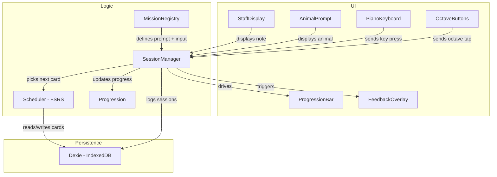
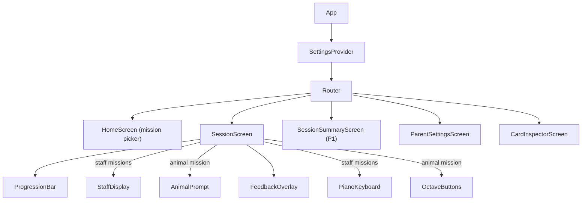

# Technical Design Document (TDD)

## Glossary

| Term | Definition |
|---|---|
| **Mission** | A play configuration that defines what the child sees (prompt type), how they answer (input type), and which items are in the FSRS card pool. Missions are selected from the home screen. |
| **Challenge** | A single question within a session. Depending on the mission, the prompt is a staff note or animal picture, and the response is a piano key press or octave button tap. |
| **Session** | One complete play-through — Buzz starts at the left, the learner works through challenges, and the session ends when Buzz reaches the Moon (or the learner quits). Each session belongs to a specific mission. |
| **Card** | An FSRS spaced-repetition card wrapping a single learnable item. In staff missions, this is a note. In Animal Octaves mission, this is an octave. Each mission has its own independent card pool. |
| **Progression** | The visual Buzz Lightyear → Moon mechanic. Correct answers advance Buzz, incorrect answers move him backward. Uses floor-at-zero scoring (no negative debt). Reaching the Moon completes the session. |
| **Note** | A musical note identified by pitch (C–B), accidental (sharp/flat/natural), octave, and clef. |

---

## Architecture Overview

Vibeyond is a multi-mission music recognition app. The core loop — show a prompt, accept input, evaluate, track mastery — is shared across missions. What varies per mission is the prompt type (staff note vs. animal picture), the input type (piano keyboard vs. octave buttons), and the card pool.



**UI layer** — React components for prompts (staff display, animal prompt), inputs (piano keyboard, octave buttons), progression bar, and feedback animations. These receive data and fire callbacks; they don't manage session state.

**Logic layer** — The session manager orchestrates the core loop. A mission registry defines available missions and their configurations. The FSRS scheduler operates on mission-scoped card pools. Pure functions and Zustand stores, no UI.

**Persistence layer** — Dexie wrapping IndexedDB. Stores FSRS cards (keyed by mission + item ID), session history, and settings. No backend, no network calls.

### React Component Tree



---

## Tech Stack

| Concern | Choice | Rationale |
|---|---|---|
| Framework | React 19 + TypeScript | Component model fits UI layer; strong typing for data model |
| Build tool | Vite | Fast dev server, native TS/TSX support, easy PWA plugin |
| Styling | Tailwind CSS | Utility-first, rapid iteration, small bundle with purging |
| Animations | Framer Motion | Declarative spring animations for bouncy, toy-like feel |
| Music notation | VexFlow | Staff rendering with correct note placement; may fall back to custom SVG if too inflexible |
| Audio | Tone.js + `tonejs-instrument-piano-mp3` | Low-latency playback via Web Audio API; MIT-licensed samples pre-split by note (~10-15 MB) |
| Spaced repetition | ts-fsrs | TypeScript FSRS implementation; proven algorithm, tunable parameters |
| State management | Zustand | Minimal boilerplate, works well with React; simpler than Redux, more capable than Context for cross-cutting state |
| Persistence | Dexie.js (IndexedDB) | Typed IndexedDB wrapper; reactive queries, simple migrations |
| PWA | vite-plugin-pwa | Service worker generation, asset pre-caching, offline support (P1) |
| Testing | Vitest + React Testing Library | Fast, Vite-native test runner with familiar React testing patterns |
| Linting | ESLint + Prettier | Standard code quality tooling |

---

## Data Model

### Core Entities

```typescript
/** Identifies a mission. Used as a key prefix for FSRS cards. */
type MissionId = "animal-octaves" | "treble-no-accidentals" | "treble" | "treble-bass";

/**
 * A mission definition. Statically defined in code (not user-created).
 * Determines what the child sees and how they interact.
 */
interface MissionDefinition {
  id: MissionId;
  name: string;                        // e.g. "Animal Octaves"
  description: string;                 // shown on home screen
  promptType: "animal" | "staff";      // what's displayed as the challenge
  inputType: "octave-buttons" | "piano"; // how the child answers
  enabledClefs: ("treble" | "bass")[]; // which clefs (staff missions only)
  includeAccidentals: boolean;         // whether sharps/flats are in the pool
  challengeRange: {                    // note range for staff missions
    minNote: Note;
    maxNote: Note;
  };
  defaultSessionLength: number;        // correct answers needed to reach Moon
}

/** A musical note identified by its pitch name, accidental, octave, and clef. */
interface Note {
  pitch: "C" | "D" | "E" | "F" | "G" | "A" | "B";
  accidental: "sharp" | "flat" | "natural";
  octave: number;           // e.g. 4 for middle C
  clef: "treble" | "bass";
}

/** Unique string key for a note, e.g. "treble:C:natural:4" */
type NoteId = string;

/**
 * Unique key for an FSRS card, scoped to a mission.
 * Format: "<missionId>:<itemId>" where itemId is a NoteId (staff missions)
 * or an octave identifier like "octave:2" (animal mission).
 */
type CardId = string;

/**
 * An FSRS card wrapping a learnable item. Scoped to a mission so that
 * each mission tracks its own independent progress.
 */
interface Card {
  cardId: CardId;            // e.g. "treble:treble:C:natural:4" or "animal-octaves:octave:2"
  missionId: MissionId;            // which mission this card belongs to
  noteId: NoteId;            // the note (or octave) this card represents
  // FSRS fields
  stability: number;
  difficulty: number;
  due: Date;
  lastReview: Date | null;
  reps: number;
  lapses: number;
  state: "new" | "learning" | "review" | "relearning";
}

/** A single challenge within a session. */
interface Challenge {
  promptNote: Note;          // the note shown on the staff (or octave for animal mission)
  responseNote: Note | null; // the key the user pressed (null if unanswered)
  correct: boolean | null;
  responseTimeMs: number | null;
  timestamp: Date;
}

/** A complete play-through from start to celebration (or quit). */
interface Session {
  id: string;
  missionId: MissionId;            // which mission this session was played in
  startedAt: Date;
  completedAt: Date | null;
  challenges: Challenge[];
  totalCorrect: number;
  totalIncorrect: number;
  score: number;             // running score with floor-at-zero semantics
  completed: boolean;        // true if Buzz reached the Moon
}

/** Parent-configurable settings. */
interface Settings {
  noteRange: {
    minNote: Note;           // keyboard display range (visual only)
    maxNote: Note;
  };
  sessionLength: number;     // default; may be overridden per-mission in future
}
```

### Mission Registry

```typescript
/** Static mission definitions — not user-configurable. */
const MISSIONS: MissionDefinition[] = [
  {
    id: "animal-octaves",
    name: "Animal Octaves",
    description: "Match animals to their sounds",
    promptType: "animal",
    inputType: "octave-buttons",
    enabledClefs: [],
    includeAccidentals: false,
    challengeRange: { /* C2-B5 spanning 4 octaves */ },
    defaultSessionLength: 10,
  },
  {
    id: "treble-no-accidentals",
    name: "Treble (White Keys)",
    description: "Treble clef, no sharps or flats",
    promptType: "staff",
    inputType: "piano",
    enabledClefs: ["treble"],
    includeAccidentals: false,
    challengeRange: { /* C4-B5 */ },
    defaultSessionLength: 20,
  },
  {
    id: "treble",
    name: "Treble",
    description: "Treble clef, all notes",
    promptType: "staff",
    inputType: "piano",
    enabledClefs: ["treble"],
    includeAccidentals: true,
    challengeRange: { /* C4-A5 */ },
    defaultSessionLength: 30,
  },
  {
    id: "treble-bass",
    name: "Treble + Bass",
    description: "Both clefs, all notes",
    promptType: "staff",
    inputType: "piano",
    enabledClefs: ["treble", "bass"],
    includeAccidentals: true,
    challengeRange: { /* C3-A5 */ },
    defaultSessionLength: 30,
  },
];
```

### Dexie Schema

```typescript
const db = new Dexie("VibeyondDB");
db.version(2).stores({
  cards: "cardId, missionId, due, state",  // cardId is now mission-scoped
  sessions: "id, missionId, startedAt",    // sessions track which mission
  settings: "key",
});
```

---

## Key Functions

The core logic is a set of plain functions and a Zustand store — no abstract interfaces or plugin system.

```typescript
/** Convert a note to absolute semitone value for enharmonic comparison. */
function noteToSemitone(note: Note): number {
  const SEMITONES = { C: 0, D: 2, E: 4, F: 5, G: 7, A: 9, B: 11 };
  let semi = note.octave * 12 + SEMITONES[note.pitch];
  if (note.accidental === "sharp") semi += 1;
  if (note.accidental === "flat") semi -= 1;
  return semi;
}

/**
 * Evaluate whether the pressed key matches the displayed note.
 * Uses enharmonic-aware matching: C# = Db, E# = F, etc.
 */
function evaluateAnswer(prompt: Note, response: Note): {
  correct: boolean;
  feedback?: { expected: string; actual: string };
} {
  const correct = noteToSemitone(prompt) === noteToSemitone(response);
  return {
    correct,
    feedback: correct ? undefined : {
      expected: noteToString(prompt),
      actual: noteToString(response),
    },
  };
}

/** Pick the next note to show based on FSRS scheduling. */
function selectNextCard(cards: Card[]): Card {
  // Cards due soonest come first; new cards mixed in
  return cards.sort((a, b) => a.due.getTime() - b.due.getTime())[0];
}

/**
 * Generate note range including all accidentals.
 * For each natural in the range, generates the natural plus its sharp and flat.
 * Includes theoretical accidentals (E#, Fb, B#, Cb) so every enharmonic
 * spelling is a separate card. Range bounds use semitone comparison.
 */
function noteRange(min: Note, max: Note, clef: string): Note[] {
  // Iterates all pitches × accidentals, filters by semitone range
}

/** Update a card after a review using ts-fsrs. */
function reviewCard(card: Card, correct: boolean): Card {
  // Wraps ts-fsrs scheduling logic, using child-tuned parameters below
}

/** Calculate Buzz's position (0–1) from the session's running score. */
function calculateProgression(
  score: number,
  sessionLength: number,
): number {
  // score / sessionLength, clamped to [0, 1]
  // Score uses floor-at-zero: correct +1, incorrect max(0, score-1)
}
```

### FSRS Configuration

Default FSRS parameters are calibrated for adult Anki users. A 5-year-old needs higher success rates (motivation), shorter initial intervals (weaker working memory for abstract symbols), and a capped maximum interval (notes should never fully disappear).

```typescript
import { FSRS, GeneratorParameters } from 'ts-fsrs';

const params = new GeneratorParameters();
params.request_retention = 0.95; // Default 0.9 — higher keeps success rate up for morale
params.maximum_interval = 30;    // Default 36500 — cap at 30 days so mastered notes still recur
params.w = [
  0.1, 0.2, 0.5, 1.0,           // Initial stability: much shorter than defaults [0.4, 0.6, 2.4, 5.8]
  4.5, 0.1, 1.0, 0.5,           // Difficulty parameters
  0.4, 0.15, 1.4,               // Interval modifiers
  0.2, 0.3, 0.4, 1.0, 0.5      // Retention/weights
];

const fsrs = new FSRS(params);
```

**Rationale:**
- **0.95 retention** — A 5% failure rate instead of 10%. Keeps Buzz moving forward more often, building a positive feedback loop.
- **Short initial stability** `[0.1, 0.2, 0.5, 1.0]` — New notes reappear within the same session or by the next day, not after a week.
- **30-day max interval** — Even mastered notes pop up monthly as easy wins.

**Session guardrail:** Limit new notes to ~2 per session. FSRS can aggressively introduce new material when the learner is doing well, but physical finger-mapping needs more time than mental recognition.

---

## Project Structure

```
vibeyond/
├── docs/
│   ├── PRD.md
│   ├── TDD.md
│   ├── UX-SPEC.md
│   └── RETENTION.md
├── public/
│   ├── buzz.png                # Buzz Lightyear character image
│   ├── animals/                # Animal illustrations for octave mission
│   │   ├── elephant.svg
│   │   ├── penguin.svg
│   │   ├── hedgehog.svg
│   │   └── mouse.svg
│   └── samples/                # Piano audio samples (mp3/ogg)
├── src/
│   ├── main.tsx                # Entry point
│   ├── App.tsx                 # Router + providers
│   ├── types.ts                # Shared type definitions
│   ├── missions.ts                # Mission registry (static mission definitions)
│   ├── logic/                  # Core logic (no UI)
│   │   ├── progression.ts      # Buzz → Moon progress calculation
│   │   ├── scheduler.ts        # FSRS scheduling wrapper
│   │   ├── evaluate.ts         # Answer evaluation (note + octave)
│   │   └── noteUtils.ts        # noteToId, noteFromId, noteRange, etc.
│   ├── components/             # React components
│   │   ├── StaffDisplay.tsx    # VexFlow staff rendering
│   │   ├── PianoKeyboard.tsx   # On-screen piano (staff missions)
│   │   ├── OctaveButtons.tsx   # 4 large animal buttons (animal mission)
│   │   ├── AnimalPrompt.tsx    # Animal picture display (animal mission)
│   │   ├── useAudio.ts         # Tone.js hook for key sounds
│   │   ├── ProgressionBar.tsx  # Buzz Lightyear → Moon
│   │   ├── FeedbackOverlay.tsx # Correct/incorrect animations
│   │   ├── Celebration.tsx     # Moon-reached celebration
│   │   └── StarField.tsx       # Background starfield animation
│   ├── screens/                # Top-level route screens
│   │   ├── HomeScreen.tsx      # Mission picker
│   │   ├── SessionScreen.tsx   # Core gameplay (adapts per mission)
│   │   ├── CardInspectorScreen.tsx
│   │   └── ParentSettingsScreen.tsx
│   ├── store/                  # Zustand stores
│   │   ├── sessionStore.ts     # Mission-aware session management
│   │   ├── cardStore.ts        # Mission-scoped FSRS card pools
│   │   └── settingsStore.ts
│   ├── db/                     # Dexie database setup + queries
│   │   └── db.ts
│   └── styles/
│       └── index.css           # Tailwind directives + custom theme
├── index.html
├── vite.config.ts
├── vitest.config.ts
├── tsconfig.json
├── package.json
└── README.md
```

---

## Card Inspector

The Card Inspector is a parent-facing screen at `/cards`, linked from the Settings screen. It gives full visibility into the FSRS card state, filtered by the selected mission.

### Data Sources

No new persistence is needed. All data comes from existing stores:

- **Card list + FSRS state**: `cardStore` → Dexie `cards` table, filtered by `missionId`. Each `AppCard` has `cardId`, `missionId`, `noteId`, `state` (New/Learning/Review/Relearning), `reps`, `lapses`, `due`, `stability`, `difficulty`.
- **Per-card success rate**: Computed by scanning `Session.challenges` from Dexie `sessions` table, filtered to sessions matching the selected mission.

### Screen Layout

```
┌─────────────────────────────────────────┐
│  ← Back              Card Inspector     │
├─────────────────────────────────────────┤
│  22 cards total                         │
│  [14 New] [5 Learning] [3 Review]       │
├─────────────────────────────────────────┤
│  Sort: Note ▾ | State ▾ | Success ▾    │
├─────────────────────────────────────────┤
│  C4    ● New       0 reps    —          │
│  D4    ● Review    12 reps   92%        │
│  E4    ● Learning  3 reps    67%        │
│  F4    ● Review    8 reps    88%        │
│  ...                                    │
└─────────────────────────────────────────┘
```

### Components

- **`CardInspectorScreen`** — Route screen at `/cards`. Loads all cards and sessions on mount, computes per-card stats, renders summary + list.
- **Summary bar** — Total card count + state breakdown badges (colored by state).
- **Card row** — Note name, state badge, rep count, success rate (or "—" if no attempts), due status ("due now" / "in 2d" / etc.).
- **Sort controls** — Toggle between note order (default), FSRS state, or success rate ascending.

### Stats Computation

```typescript
/** Compute per-note stats from session history. */
function computeNoteStats(sessions: Session[]): Map<NoteId, { attempts: number; correct: number }> {
  const stats = new Map();
  for (const session of sessions) {
    for (const challenge of session.challenges) {
      const id = noteToId(challenge.promptNote);
      const entry = stats.get(id) ?? { attempts: 0, correct: 0 };
      entry.attempts++;
      if (challenge.correct) entry.correct++;
      stats.set(id, entry);
    }
  }
  return stats;
}
```

This is computed once on screen mount — no need for real-time reactivity since this is a read-only diagnostic view.

---

## Infrastructure

### Hosting

Static site hosting — one of:
- **Vercel** (preferred) — zero-config Vite deploys, preview deploys on PRs
- GitHub Pages — simpler, free, good fallback option
- Netlify — equivalent to Vercel for this use case

No server component. All logic runs client-side. All data stays in the browser's IndexedDB.

### CI/CD

GitHub Actions pipeline:

```yaml
# On push/PR to main
- TypeScript type-check (tsc --noEmit)
- ESLint
- Vitest (unit + component tests)
- Build (vite build)
- Lighthouse CI (PWA score, performance budget) — P1
```

### Deployment

- `main` branch auto-deploys to production
- PR branches get preview deploys (Vercel/Netlify)
- No staging environment needed — single-user app

---

## Security Considerations

**Threat model**: This is a single-user, local-only app with no authentication, no backend, and no sensitive data. The attack surface is minimal.

- **No auth required** — the app is used by one family on their own device. Parent settings are accessible but not security-critical.
- **No sensitive data** — only FSRS card states and session history are stored in IndexedDB. No PII, no credentials.
- **Content Security Policy** — when PWA support is added (P1), configure CSP headers to restrict script sources and prevent XSS:
  - `default-src 'self'`
  - `script-src 'self'`
  - `style-src 'self' 'unsafe-inline'` (Tailwind requires inline styles)
  - `media-src 'self'` (piano samples)
- **Dependencies** — keep dependencies minimal and audit with `npm audit` in CI.
- **No external network calls** — the app makes zero API requests at runtime. All assets are bundled or pre-cached.

---

## P0 Feature Coverage

Cross-reference of every P0 feature from the PRD with its technical implementation:

| PRD Feature | Technical Implementation |
|---|---|
| Mission system | `missions.ts` registry + `HomeScreen` mission picker + mission-aware `SessionScreen` |
| Animal Octaves mission | `AnimalPrompt` + `OctaveButtons` components, 4-card FSRS pool |
| Treble (no accidentals) mission | `StaffDisplay` + `PianoKeyboard`, naturals-only card pool |
| Treble mission | `StaffDisplay` + `PianoKeyboard`, full chromatic card pool (current behavior) |
| Treble + Bass mission | `StaffDisplay` + `PianoKeyboard`, both clefs in card pool |
| Staff display | `StaffDisplay` component using VexFlow |
| On-screen piano | `PianoKeyboard` component with Tone.js audio |
| Answer evaluation | `evaluate.ts` — note comparison (staff missions) + octave comparison (animal mission) |
| Buzz Lightyear progression | `ProgressionBar` component driven by `logic/progression.ts`, floor-at-zero scoring |
| Spaced repetition engine | `logic/scheduler.ts` wrapping ts-fsrs, mission-scoped `Card` pools in Dexie |
| Parent settings | `ParentSettingsScreen` reading/writing `Settings` in Dexie |
| Galactic theme | Tailwind theme + Framer Motion animations + `StarField` with horizontal/vertical parallax |

### P1 Feature Coverage

| PRD Feature | Technical Implementation |
|---|---|
| Card Inspector | `CardInspectorScreen` at `/cards`. Mission-filtered view of FSRS cards. Summary bar + sortable card list. |
| Note sequences | TBD — potential new mission |
| Session summary | `SessionSummaryScreen` — TBD |
| Offline support | `vite-plugin-pwa` service worker + asset pre-caching — TBD |
| Difficulty progression | TBD |
| Per-mission settings | TBD — extend Settings to allow per-mission session length overrides |
