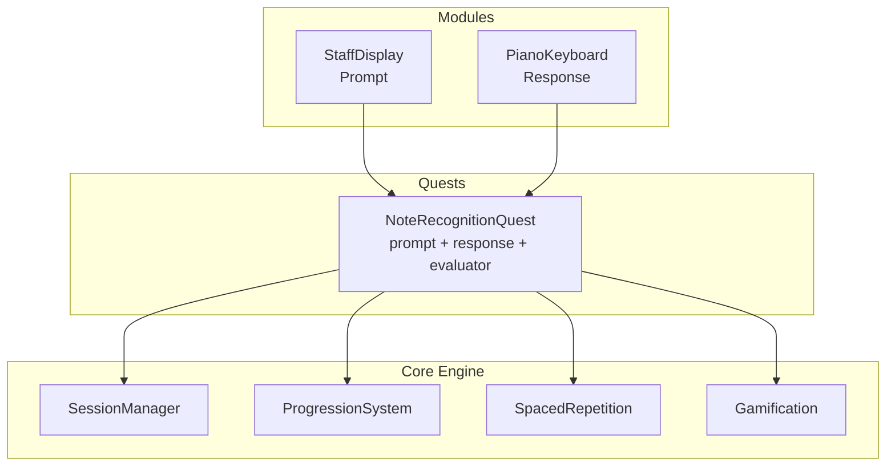

# Technical Design Document (TDD)

## Architecture Overview

Vibeyond uses a three-layer architecture that separates domain-specific learning content from the gamification and session engine. This allows new learning domains (chess puzzles, math drills, etc.) to be added without touching the core engine.

### Layers



<details><summary>ASCII fallback</summary>

```
┌─────────────────────────────────────────────────────┐
│                     Modules                          │
│  ┌──────────────┐  ┌──────────────┐                 │
│  │ StaffDisplay  │  │ PianoKeyboard│                 │
│  │  (prompt)     │  │  (response)  │                 │
│  └──────┬───────┘  └──────┬───────┘                 │
├─────────┼─────────────────┼─────────────────────────┤
│         │      Quests     │                          │
│         ▼                 ▼                          │
│  ┌────────────────────────────────┐                  │
│  │   NoteRecognitionQuest         │                  │
│  │   prompt: StaffDisplay         │                  │
│  │   response: PianoKeyboard      │                  │
│  │   evaluator: noteMatchEval     │                  │
│  └──────────────┬─────────────────┘                  │
├─────────────────┼───────────────────────────────────┤
│                 │    Core Engine                      │
│                 ▼                                     │
│  ┌──────────────────────────────────────────┐        │
│  │  SessionManager   ProgressionSystem       │        │
│  │  SpacedRepetition  Gamification            │        │
│  └──────────────────────────────────────────┘        │
└─────────────────────────────────────────────────────┘
```

</details>

**Modules** — Swappable UI components that serve as prompts or responses. Each module is a React component conforming to a typed interface. Modules are purely presentational and have no knowledge of scoring, progression, or scheduling.

**Quests** — Compose a prompt module, a response module, and an evaluator into a specific learning experience. A quest definition is a plain configuration object — no class hierarchy, no inheritance. The `NoteRecognitionQuest` wires `StaffDisplay` + `PianoKeyboard` + a note-matching evaluator.

**Core Engine** — Domain-agnostic runtime: session flow, spaced repetition scheduling, progression (Buzz Lightyear → Moon), and celebration triggers. It receives challenges from the quest's evaluator and drives the UI accordingly.

### React Component Tree

```
<App>
  <SettingsProvider>
    <Router>
      <HomeScreen />
      <SessionScreen>
        <ProgressionBar />          ← Buzz → Moon
        <PromptArea>
          <StaffDisplay />          ← injected by quest
        </PromptArea>
        <FeedbackOverlay />         ← correct/incorrect animations
        <ResponseArea>
          <PianoKeyboard />         ← injected by quest
        </ResponseArea>
      </SessionScreen>
      <SessionSummaryScreen />    ← P1: post-session stats
      <ParentSettingsScreen />
    </Router>
  </SettingsProvider>
</App>
```

---

## Tech Stack

| Concern | Choice | Rationale |
|---|---|---|
| Framework | React 19 + TypeScript | Component model fits module architecture; strong typing for interfaces |
| Build tool | Vite | Fast dev server, native TS/TSX support, easy PWA plugin |
| Styling | Tailwind CSS | Utility-first, rapid iteration, small bundle with purging |
| Animations | Framer Motion | Declarative spring animations for bouncy, toy-like feel |
| Music notation | VexFlow (or custom SVG) | Staff rendering with correct note placement; see Open Questions |
| Audio | Tone.js | Low-latency playback of piano samples with Web Audio API |
| Spaced repetition | ts-fsrs | TypeScript FSRS implementation; proven algorithm, tunable parameters |
| State management | Zustand | Minimal boilerplate, works well with React; simpler than Redux, more capable than Context for cross-cutting state |
| Persistence | Dexie.js (IndexedDB) | Typed IndexedDB wrapper; reactive queries, simple migrations |
| PWA | vite-plugin-pwa | Service worker generation, asset pre-caching, offline support (P1) |
| Testing | Vitest + React Testing Library | Fast, Vite-native test runner with familiar React testing patterns |
| Linting | ESLint + Prettier | Standard code quality tooling |

---

## Data Model

### Core Entities

```typescript
/** A musical note identified by its pitch name, octave, and clef. */
interface Note {
  pitch: "C" | "D" | "E" | "F" | "G" | "A" | "B";
  octave: number;           // e.g. 4 for middle C
  clef: "treble" | "bass";
}

/** Unique string key for a note, e.g. "treble:C4" */
type NoteId = string;

/**
 * An FSRS card wrapping a note. Tracks review state for
 * spaced repetition scheduling.
 */
interface Card {
  noteId: NoteId;
  // FSRS fields
  stability: number;
  difficulty: number;
  due: Date;
  lastReview: Date | null;
  reps: number;
  lapses: number;
  state: "new" | "learning" | "review" | "relearning";
}

/** A single challenge within a session. */
interface Challenge {
  promptNote: Note;          // the note shown on the staff
  responseNote: Note | null; // the key the user pressed (null if unanswered)
  correct: boolean | null;
  responseTimeMs: number | null;
  timestamp: Date;
}

/** A complete play-through from start to celebration (or quit). */
interface Session {
  id: string;
  startedAt: Date;
  completedAt: Date | null;
  challenges: Challenge[];
  totalCorrect: number;
  totalIncorrect: number;
  completed: boolean;        // true if Buzz reached the Moon
}

/** Configuration for a quest — ties prompt + response + evaluator together. */
interface QuestConfig {
  id: string;
  name: string;
  promptModule: React.ComponentType<PromptModuleProps>;
  responseModule: React.ComponentType<ResponseModuleProps>;
  evaluator: Evaluator;
  cardSelector: (cards: Card[]) => Card;  // picks next card (FSRS scheduling)
}

/** Parent-configurable settings. */
interface Settings {
  noteRange: {
    minNote: Note;   // e.g. { pitch: "C", octave: 4, clef: "treble" }
    maxNote: Note;   // e.g. { pitch: "G", octave: 5, clef: "treble" }
  };
  enabledClefs: ("treble" | "bass")[];
  sessionLength: number;     // number of correct answers to reach the Moon
}
```

### Dexie Schema

```typescript
const db = new Dexie("VibeyondDB");
db.version(1).stores({
  cards: "noteId, due, state",
  sessions: "id, startedAt",
  settings: "key",           // single-row key-value for settings
});
```

---

## Key Interfaces

These interfaces define the contract between the core engine and quest modules. Any new learning domain implements these to plug into the engine.

```typescript
/** Props provided to a prompt module by the core engine. */
interface PromptModuleProps {
  /** The current challenge data to display. */
  challenge: unknown;
  /** Called when the prompt is ready (e.g. animation finished). */
  onReady: () => void;
}

/** Props provided to a response module by the core engine. */
interface ResponseModuleProps {
  /** Whether input is currently accepted. */
  disabled: boolean;
  /** Called when the user submits a response. */
  onResponse: (response: unknown) => void;
}

/**
 * Evaluates whether a response matches a prompt.
 * Returns a result the core engine uses for scoring and FSRS updates.
 */
interface Evaluator {
  evaluate(challenge: unknown, response: unknown): EvaluationResult;
}

interface EvaluationResult {
  correct: boolean;
  /** Optional data for feedback display (e.g. "You pressed D, expected C"). */
  feedback?: {
    expected: string;
    actual: string;
  };
}

/**
 * A quest definition registers modules + evaluator into the core engine.
 * This is the single object needed to add a new learning domain.
 */
interface QuestDefinition {
  id: string;
  name: string;
  description: string;
  promptModule: React.ComponentType<PromptModuleProps>;
  responseModule: React.ComponentType<ResponseModuleProps>;
  evaluator: Evaluator;
  /** Generates a challenge from a Card (domain-specific). */
  challengeFromCard: (card: Card) => unknown;
}
```

### Note Recognition Quest (concrete example)

```typescript
const noteRecognitionQuest: QuestDefinition = {
  id: "note-recognition",
  name: "Note Recognition",
  description: "See a note on the staff, press the matching piano key",
  promptModule: StaffDisplay,
  responseModule: PianoKeyboard,
  evaluator: {
    evaluate(challenge: Note, response: Note): EvaluationResult {
      const correct =
        challenge.pitch === response.pitch &&
        challenge.octave === response.octave;
      return {
        correct,
        feedback: correct ? undefined : {
          expected: `${challenge.pitch}${challenge.octave}`,
          actual: `${response.pitch}${response.octave}`,
        },
      };
    },
  },
  challengeFromCard: (card: Card) => noteFromId(card.noteId),
};
```

---

## Project Structure

```
vibeyond/
├── docs/
│   ├── PRD.md
│   └── TDD.md
├── public/
│   ├── icons/                  # PWA icons
│   └── samples/                # Piano audio samples (mp3/ogg)
├── src/
│   ├── main.tsx                # Entry point
│   ├── App.tsx                 # Router + providers
│   ├── core/                   # Core engine (domain-agnostic)
│   │   ├── session.ts          # Session state machine
│   │   ├── progression.ts      # Buzz → Moon progress logic
│   │   ├── scheduler.ts        # FSRS scheduling wrapper
│   │   └── types.ts            # Shared interfaces (PromptModuleProps, etc.)
│   ├── quests/                 # Quest definitions
│   │   └── note-recognition/
│   │       ├── quest.ts        # QuestDefinition for note recognition
│   │       └── evaluator.ts    # Note-matching evaluator
│   ├── modules/                # Reusable prompt/response modules
│   │   ├── staff-display/
│   │   │   └── StaffDisplay.tsx
│   │   └── piano-keyboard/
│   │       ├── PianoKeyboard.tsx
│   │       └── useAudio.ts     # Tone.js hook for key sounds
│   ├── components/             # Shared UI components
│   │   ├── ProgressionBar.tsx   # Buzz Lightyear → Moon
│   │   ├── FeedbackOverlay.tsx  # Correct/incorrect animations
│   │   ├── Celebration.tsx      # Moon-reached celebration
│   │   └── StarField.tsx        # Background starfield animation
│   ├── screens/                # Top-level route screens
│   │   ├── HomeScreen.tsx
│   │   ├── SessionScreen.tsx
│   │   ├── SessionSummaryScreen.tsx  # P1
│   │   └── ParentSettingsScreen.tsx
│   ├── store/                  # Zustand stores
│   │   ├── sessionStore.ts
│   │   ├── cardStore.ts
│   │   └── settingsStore.ts
│   ├── db/                     # Dexie database setup + queries
│   │   └── db.ts
│   ├── utils/                  # Pure utility functions
│   │   └── noteUtils.ts        # noteToId, noteFromId, noteRange, etc.
│   └── styles/
│       └── index.css           # Tailwind directives + custom theme
├── index.html
├── tailwind.config.ts
├── vite.config.ts
├── tsconfig.json
├── package.json
└── README.md
```

---

## Infrastructure

### Hosting

Static site hosting — one of:
- **Vercel** (preferred) — zero-config Vite deploys, preview deploys on PRs
- GitHub Pages — simpler, free, good fallback option
- Netlify — equivalent to Vercel for this use case

No server component. All logic runs client-side. All data stays in the browser's IndexedDB.

### CI/CD

GitHub Actions pipeline:

```yaml
# On push/PR to main
- TypeScript type-check (tsc --noEmit)
- ESLint
- Vitest (unit + component tests)
- Build (vite build)
- Lighthouse CI (PWA score, performance budget) — P1
```

### Deployment

- `main` branch auto-deploys to production
- PR branches get preview deploys (Vercel/Netlify)
- No staging environment needed — single-user app

---

## Security Considerations

**Threat model**: This is a single-user, local-only app with no authentication, no backend, and no sensitive data. The attack surface is minimal.

- **No auth required** — the app is used by one family on their own device. Parent settings are accessible but not security-critical.
- **No sensitive data** — only FSRS card states and session history are stored in IndexedDB. No PII, no credentials.
- **Content Security Policy** — when PWA support is added (P1), configure CSP headers to restrict script sources and prevent XSS:
  - `default-src 'self'`
  - `script-src 'self'`
  - `style-src 'self' 'unsafe-inline'` (Tailwind requires inline styles)
  - `media-src 'self'` (piano samples)
- **Dependencies** — keep dependencies minimal and audit with `npm audit` in CI.
- **No external network calls** — the app makes zero API requests at runtime. All assets are bundled or pre-cached.

---

## Open Questions

| # | Question | Options | Impact |
|---|---|---|---|
| 1 | **VexFlow vs. custom SVG** for staff rendering | VexFlow: full music notation library, heavy (~200KB). Custom SVG: lightweight, only need single-note rendering, more control over styling and animation. | Bundle size, dev effort, visual customization |
| 2 | **FSRS parameter tuning** for a 5-year-old | Default FSRS parameters are calibrated for adult learners (Anki-style). A 5-year-old's retention curve is likely different — shorter intervals, more repetition. | Learning effectiveness, the core value prop |
| 3 | **Asset licensing** | Buzz Lightyear is Disney IP — cannot use official imagery. Need an original space character or generic astronaut. Piano samples need a permissive license (e.g. Salamander Grand Piano, CC-BY). | Legal risk, art direction |
| 4 | **State management granularity** | Zustand is chosen, but should the session state machine use Zustand or XState for explicit state transitions? | Complexity vs. correctness for session flow |
| 5 | **Touch vs. pointer events** | iPad primary target — need to handle touch events with no 300ms delay. Framer Motion's tap handlers may suffice, or may need explicit touch event handling. | Input latency, child UX |

---

## P0 Feature Coverage

Cross-reference of every P0 feature from the PRD with its technical implementation:

| PRD Feature | Technical Implementation |
|---|---|
| Staff display | `StaffDisplay` module (VexFlow or custom SVG), injected as prompt module |
| On-screen piano | `PianoKeyboard` module with Tone.js audio, injected as response module |
| Answer evaluation | `Evaluator` interface, `noteRecognitionQuest.evaluator` |
| Buzz Lightyear progression | `ProgressionBar` component driven by `core/progression.ts` |
| Spaced repetition engine | `core/scheduler.ts` wrapping ts-fsrs, `Card` model in Dexie |
| Parent mode | `ParentSettingsScreen` reading/writing `Settings` in Dexie |
| Galactic theme | Tailwind theme config + Framer Motion animations + `StarField` background |
