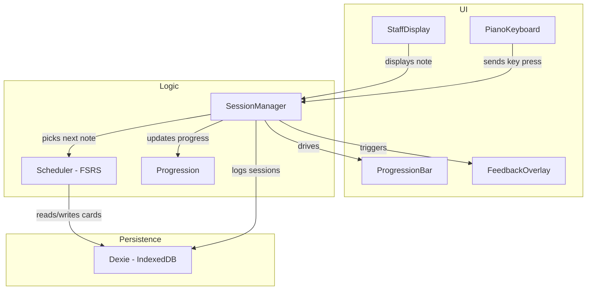
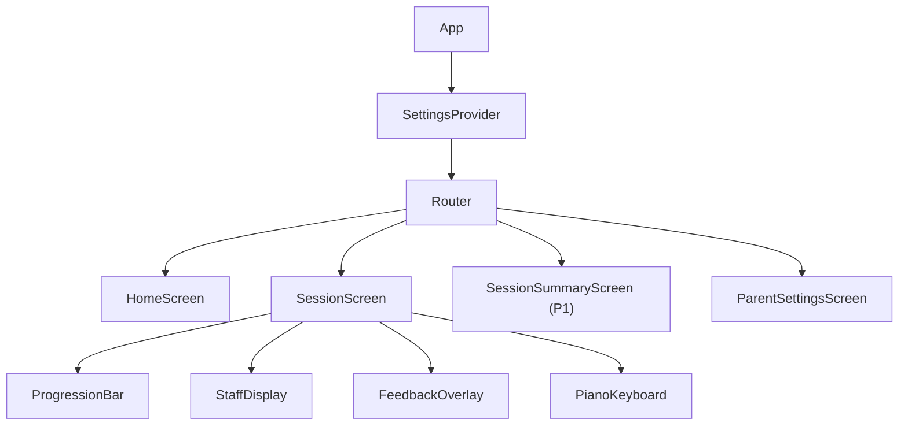

# Technical Design Document (TDD)

## Glossary

| Term | Definition |
|---|---|
| **Challenge** | A single question within a session: the app shows a note on the staff, the learner presses a piano key, and the app scores the answer. A session contains many challenges. |
| **Session** | One complete play-through — Buzz starts at the bottom, the learner works through challenges, and the session ends when Buzz reaches the Moon (or the learner quits). |
| **Card** | An FSRS spaced-repetition card wrapping a single note. Tracks how well the learner knows that note (stability, difficulty, due date, review count). The scheduler picks which card to surface next. |
| **Progression** | The visual Buzz Lightyear → Moon mechanic. Correct answers advance Buzz, incorrect answers move him backward. Reaching the Moon completes the session. |
| **Note** | A musical note identified by pitch (C–B), accidental (sharp/flat/natural), octave, and clef. |

---

## Architecture Overview

Vibeyond is a single-purpose app: show a note on a staff, have the learner press the matching piano key, track mastery over time. The architecture reflects this — clean separation of concerns without premature abstraction.



**UI layer** — React components for the staff, piano, progression bar, and feedback animations. These receive data and fire callbacks; they don't manage session state.

**Logic layer** — The session manager orchestrates the core loop: pick a note (via FSRS scheduler), show it, accept input, evaluate, update progression, repeat. Pure functions and Zustand stores, no UI.

**Persistence layer** — Dexie wrapping IndexedDB. Stores FSRS cards, session history, and settings. No backend, no network calls.

### React Component Tree



---

## Tech Stack

| Concern | Choice | Rationale |
|---|---|---|
| Framework | React 19 + TypeScript | Component model fits UI layer; strong typing for data model |
| Build tool | Vite | Fast dev server, native TS/TSX support, easy PWA plugin |
| Styling | Tailwind CSS | Utility-first, rapid iteration, small bundle with purging |
| Animations | Framer Motion | Declarative spring animations for bouncy, toy-like feel |
| Music notation | VexFlow | Staff rendering with correct note placement; may fall back to custom SVG if too inflexible |
| Audio | Tone.js + `tonejs-instrument-piano-mp3` | Low-latency playback via Web Audio API; MIT-licensed samples pre-split by note (~10-15 MB) |
| Spaced repetition | ts-fsrs | TypeScript FSRS implementation; proven algorithm, tunable parameters |
| State management | Zustand | Minimal boilerplate, works well with React; simpler than Redux, more capable than Context for cross-cutting state |
| Persistence | Dexie.js (IndexedDB) | Typed IndexedDB wrapper; reactive queries, simple migrations |
| PWA | vite-plugin-pwa | Service worker generation, asset pre-caching, offline support (P1) |
| Testing | Vitest + React Testing Library | Fast, Vite-native test runner with familiar React testing patterns |
| Linting | ESLint + Prettier | Standard code quality tooling |

---

## Data Model

### Core Entities

```typescript
/** A musical note identified by its pitch name, accidental, octave, and clef. */
interface Note {
  pitch: "C" | "D" | "E" | "F" | "G" | "A" | "B";
  accidental: "sharp" | "flat" | "natural";
  octave: number;           // e.g. 4 for middle C
  clef: "treble" | "bass";
}

/** Unique string key for a note, e.g. "treble:C#4", "treble:Bb3" */
type NoteId = string;

/**
 * An FSRS card wrapping a note. Tracks review state for
 * spaced repetition scheduling.
 */
interface Card {
  noteId: NoteId;
  // FSRS fields
  stability: number;
  difficulty: number;
  due: Date;
  lastReview: Date | null;
  reps: number;
  lapses: number;
  state: "new" | "learning" | "review" | "relearning";
}

/** A single challenge within a session. */
interface Challenge {
  promptNote: Note;          // the note shown on the staff
  responseNote: Note | null; // the key the user pressed (null if unanswered)
  correct: boolean | null;
  responseTimeMs: number | null;
  timestamp: Date;
}

/** A complete play-through from start to celebration (or quit). */
interface Session {
  id: string;
  startedAt: Date;
  completedAt: Date | null;
  challenges: Challenge[];
  totalCorrect: number;
  totalIncorrect: number;
  completed: boolean;        // true if Buzz reached the Moon
}

/** Parent-configurable settings. */
interface Settings {
  noteRange: {
    minNote: Note;   // e.g. { pitch: "C", octave: 4, clef: "treble" }
    maxNote: Note;   // e.g. { pitch: "G", octave: 5, clef: "treble" }
  };
  enabledClefs: ("treble" | "bass")[];
  sessionLength: number;     // number of correct answers to reach the Moon
}
```

### Dexie Schema

```typescript
const db = new Dexie("VibeyondDB");
db.version(1).stores({
  cards: "noteId, due, state",
  sessions: "id, startedAt",
  settings: "key",           // single-row key-value for settings
});
```

---

## Key Functions

The core logic is a set of plain functions and a Zustand store — no abstract interfaces or plugin system.

```typescript
/** Evaluate whether the pressed key matches the displayed note. */
function evaluateAnswer(prompt: Note, response: Note): {
  correct: boolean;
  feedback?: { expected: string; actual: string };
} {
  const correct =
    prompt.pitch === response.pitch &&
    prompt.accidental === response.accidental &&
    prompt.octave === response.octave;
  return {
    correct,
    feedback: correct ? undefined : {
      expected: noteToString(prompt),
      actual: noteToString(response),
    },
  };
}

/** Pick the next note to show based on FSRS scheduling. */
function selectNextCard(cards: Card[]): Card {
  // Cards due soonest come first; new cards mixed in
  return cards.sort((a, b) => a.due.getTime() - b.due.getTime())[0];
}

/** Update a card after a review using ts-fsrs. */
function reviewCard(card: Card, correct: boolean): Card {
  // Wraps ts-fsrs scheduling logic, using child-tuned parameters below
}

/** Calculate Buzz's position (0–1) given session progress. */
function calculateProgression(
  correct: number,
  incorrect: number,
  sessionLength: number,
): number {
  // Net correct / sessionLength, clamped to [0, 1]
}
```

### FSRS Configuration

Default FSRS parameters are calibrated for adult Anki users. A 5-year-old needs higher success rates (motivation), shorter initial intervals (weaker working memory for abstract symbols), and a capped maximum interval (notes should never fully disappear).

```typescript
import { FSRS, GeneratorParameters } from 'ts-fsrs';

const params = new GeneratorParameters();
params.request_retention = 0.95; // Default 0.9 — higher keeps success rate up for morale
params.maximum_interval = 30;    // Default 36500 — cap at 30 days so mastered notes still recur
params.w = [
  0.1, 0.2, 0.5, 1.0,           // Initial stability: much shorter than defaults [0.4, 0.6, 2.4, 5.8]
  4.5, 0.1, 1.0, 0.5,           // Difficulty parameters
  0.4, 0.15, 1.4,               // Interval modifiers
  0.2, 0.3, 0.4, 1.0, 0.5      // Retention/weights
];

const fsrs = new FSRS(params);
```

**Rationale:**
- **0.95 retention** — A 5% failure rate instead of 10%. Keeps Buzz moving forward more often, building a positive feedback loop.
- **Short initial stability** `[0.1, 0.2, 0.5, 1.0]` — New notes reappear within the same session or by the next day, not after a week.
- **30-day max interval** — Even mastered notes pop up monthly as easy wins.

**Session guardrail:** Limit new notes to ~2 per session. FSRS can aggressively introduce new material when the learner is doing well, but physical finger-mapping needs more time than mental recognition.

---

## Project Structure

```
vibeyond/
├── docs/
│   ├── PRD.md
│   └── TDD.md
├── public/
│   ├── icons/                  # PWA icons
│   └── samples/                # Piano audio samples (mp3/ogg)
├── src/
│   ├── main.tsx                # Entry point
│   ├── App.tsx                 # Router + providers
│   ├── logic/                  # Core logic (no UI)
│   │   ├── session.ts          # Session state machine + core loop
│   │   ├── progression.ts      # Buzz → Moon progress calculation
│   │   ├── scheduler.ts        # FSRS scheduling wrapper
│   │   ├── evaluate.ts         # Answer evaluation
│   │   └── noteUtils.ts        # noteToId, noteFromId, noteRange, etc.
│   ├── components/             # React components
│   │   ├── StaffDisplay.tsx    # VexFlow staff rendering
│   │   ├── PianoKeyboard.tsx   # On-screen piano
│   │   ├── useAudio.ts         # Tone.js hook for key sounds
│   │   ├── ProgressionBar.tsx  # Buzz Lightyear → Moon
│   │   ├── FeedbackOverlay.tsx # Correct/incorrect animations
│   │   ├── Celebration.tsx     # Moon-reached celebration
│   │   └── StarField.tsx       # Background starfield animation
│   ├── screens/                # Top-level route screens
│   │   ├── HomeScreen.tsx
│   │   ├── SessionScreen.tsx
│   │   ├── SessionSummaryScreen.tsx  # P1
│   │   └── ParentSettingsScreen.tsx
│   ├── store/                  # Zustand stores
│   │   ├── sessionStore.ts
│   │   ├── cardStore.ts
│   │   └── settingsStore.ts
│   ├── db/                     # Dexie database setup + queries
│   │   └── db.ts
│   └── styles/
│       └── index.css           # Tailwind directives + custom theme
├── index.html
├── tailwind.config.ts
├── vite.config.ts
├── tsconfig.json
├── package.json
└── README.md
```

---

## Infrastructure

### Hosting

Static site hosting — one of:
- **Vercel** (preferred) — zero-config Vite deploys, preview deploys on PRs
- GitHub Pages — simpler, free, good fallback option
- Netlify — equivalent to Vercel for this use case

No server component. All logic runs client-side. All data stays in the browser's IndexedDB.

### CI/CD

GitHub Actions pipeline:

```yaml
# On push/PR to main
- TypeScript type-check (tsc --noEmit)
- ESLint
- Vitest (unit + component tests)
- Build (vite build)
- Lighthouse CI (PWA score, performance budget) — P1
```

### Deployment

- `main` branch auto-deploys to production
- PR branches get preview deploys (Vercel/Netlify)
- No staging environment needed — single-user app

---

## Security Considerations

**Threat model**: This is a single-user, local-only app with no authentication, no backend, and no sensitive data. The attack surface is minimal.

- **No auth required** — the app is used by one family on their own device. Parent settings are accessible but not security-critical.
- **No sensitive data** — only FSRS card states and session history are stored in IndexedDB. No PII, no credentials.
- **Content Security Policy** — when PWA support is added (P1), configure CSP headers to restrict script sources and prevent XSS:
  - `default-src 'self'`
  - `script-src 'self'`
  - `style-src 'self' 'unsafe-inline'` (Tailwind requires inline styles)
  - `media-src 'self'` (piano samples)
- **Dependencies** — keep dependencies minimal and audit with `npm audit` in CI.
- **No external network calls** — the app makes zero API requests at runtime. All assets are bundled or pre-cached.

---

## P0 Feature Coverage

Cross-reference of every P0 feature from the PRD with its technical implementation:

| PRD Feature | Technical Implementation |
|---|---|
| Staff display | `StaffDisplay` component using VexFlow |
| On-screen piano | `PianoKeyboard` component with Tone.js audio |
| Answer evaluation | `evaluate.ts` — compares prompt note to pressed key |
| Buzz Lightyear progression | `ProgressionBar` component driven by `logic/progression.ts` |
| Spaced repetition engine | `logic/scheduler.ts` wrapping ts-fsrs, `Card` model in Dexie |
| Parent mode | `ParentSettingsScreen` reading/writing `Settings` in Dexie |
| Galactic theme | Tailwind theme config + Framer Motion animations + `StarField` background |
